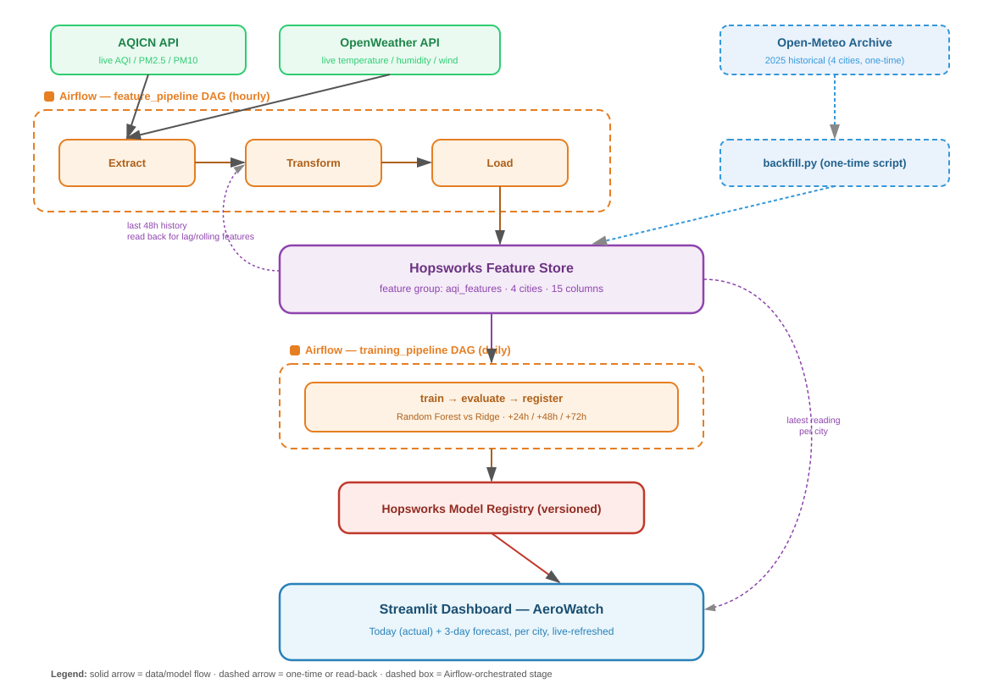

# AQI Predictor - Internship MLOps Project


## Setup
1. Fill in `.env` with your API keys
2. docker compose up -d

## Roadmap
1. Extract (done)
2. Feature engineering (transform.py)
3. Load to Hopsworks Feature Store (load.py)
4. Backfill via Airflow catchup=True
5. Train models (train.py)
6. Evaluate models (evaluate.py)
7. Model registry (registry.py)
8. Airflow DAGs (feature + training pipelines)
9. Flask prediction API (app.py)
10. Streamlit dashboard (streamlit_app.py)
11. SHAP explainability (explain.py)
12. Alerts (AQI > 300)
<div align="center">


<br/>


**An end-to-end MLOps pipeline that forecasts Air Quality Index 24/48/72 hours ahead**
for Lahore, Islamabad, Karachi, and Peshawar — fully automated, from live API ingestion
to an interactive forecast dashboard.

</div>

---

## Table of Contents

- [Overview](#overview)
- [Architecture](#architecture)
- [Features](#features)
- [Tech Stack](#tech-stack)
- [Project Structure](#project-structure)
- [Getting Started](#getting-started)
- [The Pipelines](#the-pipelines)
- [Model Performance](#model-performance)
- [Data Sources](#data-sources)
- [Roadmap](#roadmap)

---

## Overview

AeroWatch is a Data Engineering internship project built around a real MLOps
lifecycle rather than a single notebook: hourly live ingestion, a feature store,
scheduled retraining, a model registry, and a forecast dashboard — all orchestrated
by Apache Airflow in Docker.

Given today's readings (temperature, humidity, PM2.5, PM10, current AQI), the model
directly forecasts AQI **+24h, +48h, and +72h** ahead in a single prediction — a
"direct multi-horizon forecast" that avoids needing tomorrow's weather to predict
tomorrow's air quality.

## Architecture



Two Airflow DAGs drive the system:

| DAG | Schedule | What it does |
|---|---|---|
| `feature_pipeline` | Hourly | Extract → Transform → Load new readings into the Hopsworks Feature Store |
| `training_pipeline` | Daily | Fetch features → train → evaluate → register the best model |

## Features

- 🔄 **Live hourly ingestion** from AQICN + OpenWeather, per city
- 📚 **A full year of historical backfill** (2025, 4 cities) via Open-Meteo's free archive — no API key required
- 🧠 **Multi-horizon forecasting**: one model call predicts +24h / +48h / +72h AQI
- 🏆 **Automatic model selection**: Random Forest vs. Ridge Regression, evaluated on RMSE/MAE/R² per horizon
- 🗂️ **Versioned model registry** — roll back to a previous version if a retrain underperforms
- 📊 **Interactive dashboard** (Streamlit): live "Today" reading + 3-day forecast, color-coded by AQI severity, per city
- 🐳 **Fully containerized orchestration** — Airflow + Postgres via Docker Compose

## Tech Stack

| Layer | Tools |
|---|---|
| Ingestion | `requests`, AQICN API, OpenWeather API |
| Historical Data | Open-Meteo Archive (Weather + Air Quality) |
| Feature Engineering | `pandas` |
| Feature & Model Store | Hopsworks (Feature Store + Model Registry) |
| Modeling | `scikit-learn` (Random Forest, Ridge Regression) |
| Orchestration | Apache Airflow (TaskFlow API), Docker Compose |
| Dashboard | Streamlit, Plotly |
| Environment | `uv` |

## Project Structure

```
aqi-predictor/
├── dags/                       # Airflow DAGs
│   ├── feature_pipeline_dag.py     # hourly: extract -> transform -> load
│   └── training_pipeline_dag.py    # daily: train -> evaluate -> register
│
├── etl/                        # Feature pipeline logic
│   ├── extract.py                  # pulls AQICN + OpenWeather readings
│   ├── transform.py                # feature engineering (time + lag/rolling features)
│   └── load.py                     # writes to the Hopsworks Feature Store
│
├── backfill.py                 # one-time: 2025 historical data, 4 cities (Open-Meteo)
│
├── training/                   # Training pipeline logic
│   ├── train.py                    # loads features, trains candidate models
│   ├── evaluate.py                 # RMSE / MAE / R2 per forecast horizon
│   └── registry.py                 # registers the best model in Hopsworks
│
├── dashboard/
│   └── streamlit_app.py        # AeroWatch forecast dashboard
│
├── utils/
│   └── hopsworks_client.py     # shared Hopsworks connection helper
│
├── docs/                       # README graphics
│   ├── banner.svg
│   └── architecture.svg
│
├── Dockerfile.airflow           # custom Airflow image with project dependencies
├── compose.yaml                 # Airflow + Postgres (LocalExecutor)
├── requirements.txt
└── .env                         # API keys & Hopsworks credentials (not committed)
```

## Getting Started

### Prerequisites
- [uv](https://docs.astral.sh/uv/) (Python package/project manager)
- Docker Desktop (for Airflow orchestration)
- Free accounts: [AQICN](https://aqicn.org/data-platform/token/), [OpenWeather](https://openweathermap.org/api), [Hopsworks](https://www.hopsworks.ai)

### 1. Clone and configure
```bash
git clone <your-repo-url>
cd aqi-predictor
cp .env.example .env   # then fill in your API keys + Hopsworks credentials
```

### 2. Install dependencies
```bash
uv sync
```

### 3. Run the feature pipeline once, manually
```bash
uv run python -m etl.load
```

### 4. Backfill historical data (one-time)
```bash
uv run python -m backfill
```

### 5. Train and register a model
```bash
uv run python -m training.registry
```

### 6. Launch the dashboard
```bash
uv run streamlit run dashboard/streamlit_app.py
```

### 7. Bring up Airflow for full automation
```bash
docker compose up -d --build
```
Open `http://localhost:8081` (default: `admin` / `admin`) and confirm both
`feature_pipeline` and `training_pipeline` are listed and unpaused.

## The Pipelines

**Feature Pipeline (hourly)** — pulls live readings for the configured city,
engineers time features (hour/day/month/weekend) and lag/rolling features
(yesterday's AQI, 24h rolling average, hour-over-hour change rate) using the
last 48 hours of real history from Hopsworks, then writes the result back.

**Training Pipeline (daily)** — reads the full feature history, builds
+24h/+48h/+72h targets per city, trains Random Forest and Ridge Regression,
scores both per horizon, and registers whichever model has the lower average
RMSE across all three horizons.

## Model Performance

*Example results from a training run (Random Forest vs. Ridge Regression);
your own numbers will vary slightly run to run as more data accumulates.*

| Horizon | Model | RMSE | MAE | R² |
|---|---|---|---|---|
| +24h | Random Forest | 11.29 | 6.18 | 0.920 |
| +24h | Ridge Regression | 23.09 | 16.96 | 0.666 |
| +48h | Random Forest | 13.81 | 7.00 | 0.884 |
| +48h | Ridge Regression | 27.95 | 20.49 | 0.526 |
| +72h | Random Forest | 14.18 | 7.25 | 0.881 |
| +72h | Ridge Regression | 29.54 | 21.31 | 0.483 |

As expected, accuracy degrades slightly the further out the forecast — and
Random Forest comfortably outperforms Ridge Regression at every horizon.

## Data Sources

| Source | Used for | Notes |
|---|---|---|
| [AQICN](https://aqicn.org) | Live AQI, PM2.5, PM10 | Free API, current conditions only |
| [OpenWeather](https://openweathermap.org) | Live temperature, humidity, wind | Free API, current conditions only |
| [Open-Meteo](https://open-meteo.com) | 2025 historical backfill, all 4 cities | Free, no key; ERA5 (weather) + CAMS (air quality) reanalysis |

> **Note:** AQICN's AQI and Open-Meteo's US AQI are the same *concept* but not
> identical scales/methodologies. This is a known limitation of blending a live
> source with a historical one and is worth mentioning in any write-up of results.

## Roadmap

- [ ] Add a TensorFlow/Keras model as a third candidate
- [ ] Expose predictions via a Flask/FastAPI serving layer (in addition to the dashboard)
- [ ] SHAP-based explainability for individual predictions
- [ ] Alerting when forecast AQI crosses hazardous thresholds
- [ ] GitHub Actions CI for linting/tests alongside the existing Airflow automation

---

<div align="center">

Built by **Hussain Ali** — Data Science Engineer Internship 10pearls

</div>
